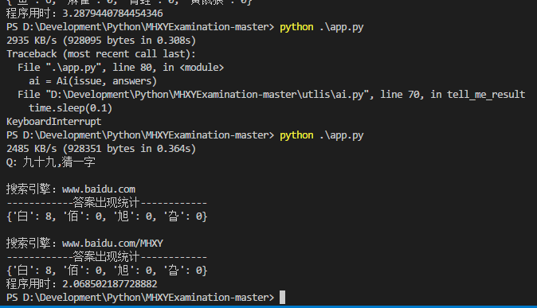
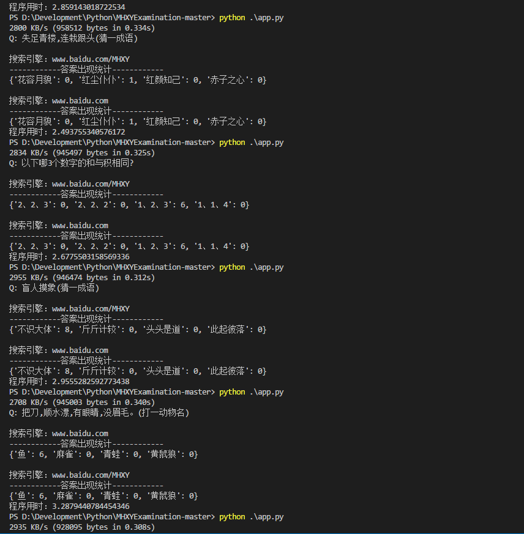

# 梦幻西游科举助手
---
参考了百万英雄的代码，优化访问请求，优化图片处理速度，对识别内容进行了处理，使其搜索结果更精确，*config.py* 中提供了所有可供修改的参数。

# 使用教程
---
**安装 ADB 驱动**
[下载地址](https://adb.clockworkmod.com/)
安装 ADB 后，请在环境变量里将 adb 的安装路径保存到 PATH 变量里，确保 adb 命令可以被识别到
  
**需要安装运行模块，输入以下命令进行安装**
`pip install baidu-aip Pillow requests`

**OCR获取**
[百度OCR申请](http://ai.baidu.com/tech/ocr/general)
在 *config.py* 里填写自己申请百度 OCR 的 APPID

**运行程序**
4.连接手机运行python app.py

# 效果图
---

# 参考资料
---
[百万英雄答题助手](https://github.com/wuditken/MillionHeroes/)
